# CellarCXL

Record-level Memory-tiering over CXL for OLTP Databases.

CellarCXL extends the buffer pool of a main-memory storage engine into a **three-tier hierarchy** (DRAM → CXL → SSD) using *record-granularity* caching rather than page-granularity tiering. The key insight is that the top 1–2% hottest record slots within a page account for ~69% of intra-page accesses under skewed workloads; page-level promotion therefore wastes most of the precious DRAM tier on cold records.

CellarCXL resolves this with three cooperating mechanisms:

1. **Two-Level Admission Control** — a page-level Count-Min Sketch filters the full access stream, then a record-level sketch activates only on hot-page candidates to classify intra-page skew.
2. **Lock-Free Record Cache** — hot records are promoted into a DRAM-resident Record Cache with epoch-based concurrency control and Write-Through support for update workloads.
3. **SIEVE-Integrated Eviction** — slab-class and zombie fast-paths reclaim capacity ahead of demand, keeping the Record Cache at steady-state occupancy.

Built on top of [LeanStore](https://github.com/leanstore/leanstore).

## Architecture

<p align="center">
  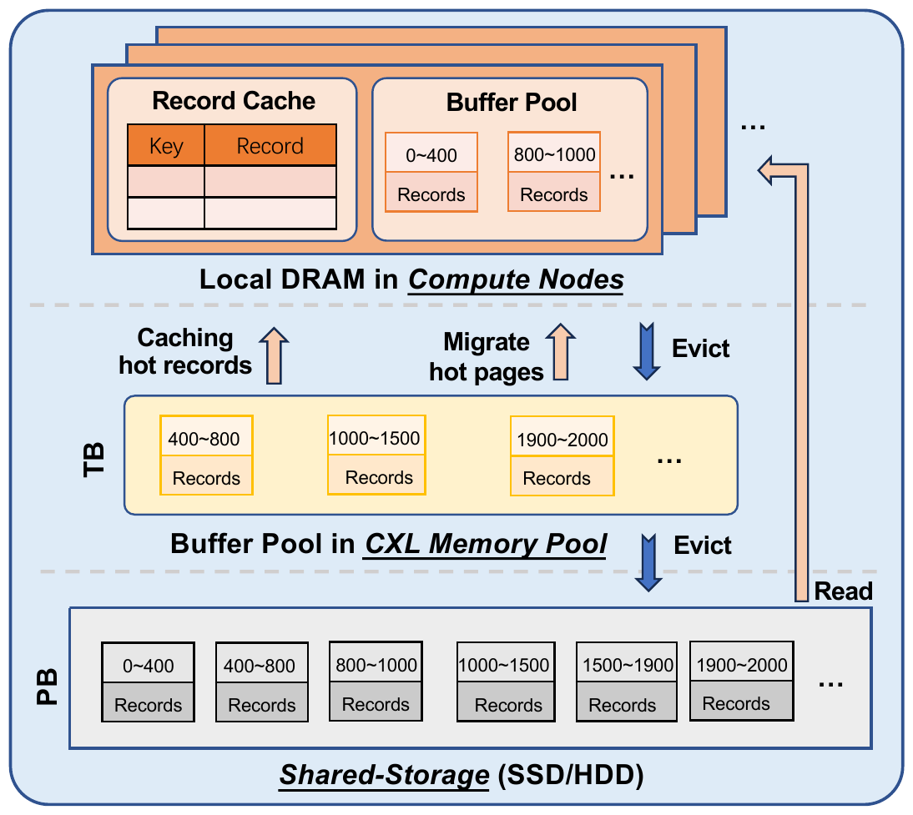
</p>

The system organizes data across three tiers:

| Tier | Medium | Latency | Role |
|------|--------|---------|------|
| DRAM | Local memory | ~146.5 ns | Record Cache (hot records) + Buffer Pool (pages) |
| CXL | CXL-attached memory | ~598.7 ns | Shared page buffer (hot pages migrated from SSD) |
| SSD | NVMe storage | ~74.49 µs (rand) / ~7.16 ms (seq) | Persistent storage |

Background threads handle admission, promotion, and eviction; foreground transaction paths add only an epoch toggle and an `OnRecordAccess` callback — no structural modification to the host B+Tree.

### Two-Level Admission Control

<p align="center">
  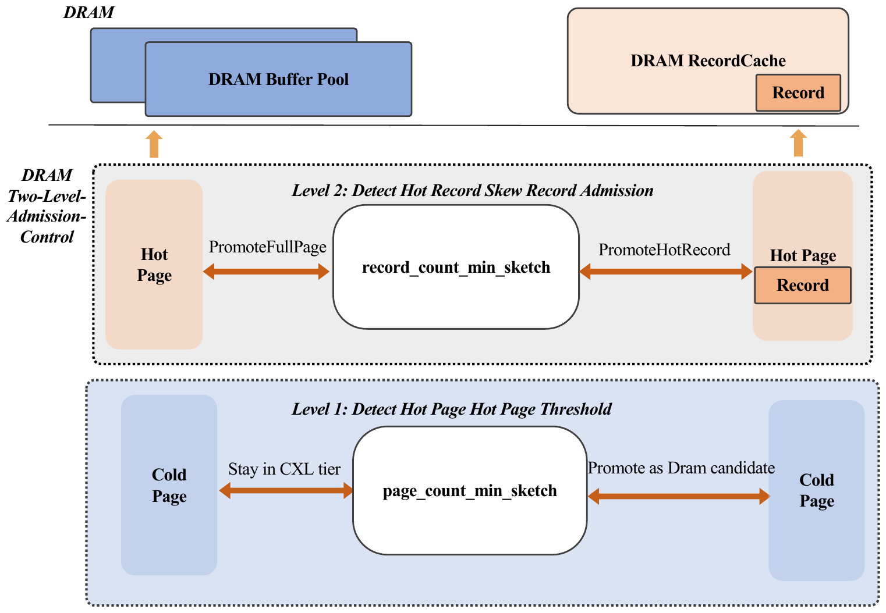
</p>

<p align="center">
  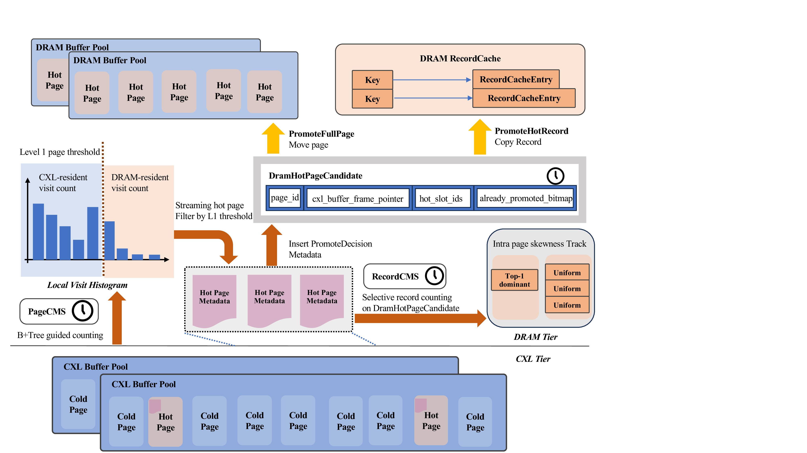
</p>

Admission is cascaded in two levels:
- **Level 1 (Page Hotness Filter):** A page-level Count-Min Sketch (`PageCMS`) streams all accesses and identifies hot-page candidates that exceed a dynamic threshold.
- **Level 2 (Record Skew Detector):** A record-level Count-Min Sketch (`RecordCMS`) activates only on promoted hot pages, classifying intra-page skew. Records exceeding the skew threshold are promoted individually into the DRAM Record Cache; otherwise the full page is promoted into the Buffer Pool.

### Record Cache Layout

<p align="center">
  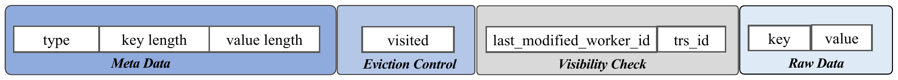
</p>

Each cached record consists of four sections: **Meta Data** (type, key length, value length), **Eviction Control** (SIEVE visited bit), **Visibility Check** (worker ID and transaction ID for MVCC), and **Raw Data** (key-value pair). This layout enables lock-free concurrent access with epoch-based reclamation.

## Branch Description

| Branch | Description |
|--------|-------------|
| `ReadOnly` | CellarCXL with read-only (no write-back) Record Cache for YCSB and TPC-C |
| `WriteThrough` | CellarCXL with write-through Record Cache for update-heavy workloads |
| `experiments` | Experiment scripts (Exp1–Exp7) for paper reproduction |

## Quick Start

### Prerequisites

```bash
sudo apt-get install cmake libtbb2-dev libaio-dev libsnappy-dev zlib1g-dev \
  libbz2-dev liblz4-dev libzstd-dev librocksdb-dev liblmdb-dev \
  libwiredtiger-dev liburing-dev
```

A C++20-capable compiler (GCC ≥ 13) is required.

### Build

```bash
git clone <repo-url> && cd CellarCXL
git checkout ReadOnly   # or WriteThrough
mkdir build && cd build
cmake -DCMAKE_BUILD_TYPE=RelWithDebInfo ..
make -j$(nproc)
```

### Runtime Parameters

```bash
build/frontend/ycsb \
    --ssd_path=/path/to/ssd/device \
    --dram_buffer_pool_gib=0.10 \
    --dram_recordcache_gib=0.50 \
    --cxl_tiering_enabled=true \
    --cxl_gib=2.5 \
    --cxl_dax_device_path=/dev/dax0.0 \
    --test_admission_mode=two_level \
    --test_zipf_theta=0.90 \
    --test_working_set_gib=4.0 \
    --worker_threads=8
```

| Parameter | Description |
|-----------|-------------|
| `--dram_buffer_pool_gib` | Buffer Pool size in DRAM |
| `--dram_recordcache_gib` | Record Cache size in DRAM |
| `--cxl_gib` | CXL tier capacity |
| `--cxl_dax_device_path` | DAX device path for CXL memory |
| `--test_admission_mode` | Admission variant: `two_level`, `page_only`, `lru`, `dram_ssd` |
| `--test_zipf_theta` | Skew parameter (0.90 / 0.95 / 0.99) |
| `--test_working_set_gib` | Working-set size (4 / 8 / 16 GiB) |

## Experiment Reproduction

The `experiments` branch contains all scripts for reproducing the paper's evaluation:

| Experiment | Script | Description |
|------------|--------|-------------|
| Exp1 & Exp2 | `exp1_exp2_scripts/` | End-to-end YCSB throughput (ReadOnly + WriteThrough), WS = 4/8/16 GiB |
| Exp3 | `exp3_scripts/` | Scalability: worker thread sweep (4/8/16/32) |
| Exp4 & Exp6 | `exp4_exp6_scripts/` | Parameter sensitivity & cold-start convergence |
| Exp5 | `exp5_profile_scrips/`, `exp5_lookup_latency_cpu_cycles_breakdown/` | Perf profiling & latency breakdown |
| Exp7 | `exp7_scripts/` | Cross-system comparison (bf-Tree, HybridTier, Tiered Indexing, Three-Tier) |

### Workload Configuration

| Workload | Operation Mix | DRAM Split (BP / RC) | Note |
|----------|---------------|----------------------|------|
| A | 50% update / 50% read | 0.10 / 0.50 | Update-heavy |
| B | 5% update / 95% read | 0.10 / 0.50 | Read-mostly |
| C | 100% read | 0.10 / 0.50 | Read-only |
| D | 5% insert / 95% **read-latest** | 0.10 / 0.50 | Temporal locality |
| E | 5% insert / 95% scan | 0.40 / 0.20 | Range-scan (BP-heavy) |
| F | Mixed read-modify-write | 0.10 / 0.50 | Read-modify-write |

> Workload D uses **read-latest** (not read-random) to capture temporal locality. All workloads except E share the RC-friendly DRAM split; E uses a BP-heavy split because range scans benefit from page-level caching.

## Key Results

### End-to-End Throughput (WS = 4 GiB, θ = 0.90)

<p align="center">
  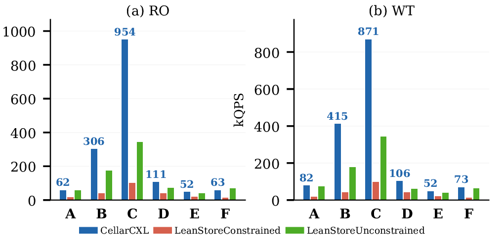
</p>

CellarCXL achieves up to **954 kOPS** (ReadOnly, YCSB-C) and **871 kOPS** (WriteThrough, YCSB-C), outperforming the constrained DRAM+SSD baseline by orders of magnitude on skewed workloads.

### Latency Breakdown — ReadOnly (WS = 4 GiB, θ = 0.90)

<p align="center">
  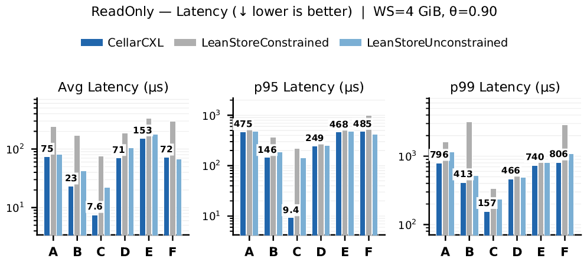
</p>

CellarCXL reduces average latency to single-digit to low-double-digit microseconds on read-intensive workloads (C: 7.6 µs, B: 23 µs), matching unconstrained DRAM performance. P99 latency remains comparable to unconstrained, while the constrained baseline suffers significantly higher latency due to SSD fallback.

### Latency Breakdown — WriteThrough (WS = 4 GiB, θ = 0.90)

<p align="center">
  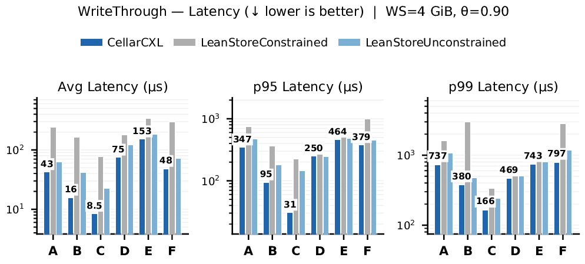
</p>

Under WriteThrough, CellarCXL achieves sub-50 µs average latency on YCSB-C (8.5 µs) and YCSB-B (16 µs), with P95 latency down to 31 µs on read-only workloads. The write-through path adds minimal overhead while maintaining near-unconstrained tail latency behavior.

### Hit Rate Breakdown (WS = 4 GiB, θ = 0.90)

<p align="center">
  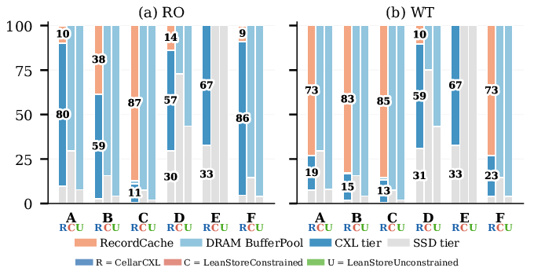
</p>

The stacked hit-rate breakdown shows that CellarCXL's Record Cache absorbs the majority of hot-record accesses (orange segments), while the CXL tier (dark blue) serves as a secondary buffer for page-level misses. Under ReadOnly, workloads A–D achieve Record Cache hit rates of 10–30%, with the remaining accesses served by the CXL and DRAM Buffer Pool tiers.

### Cross-System Comparison (Exp7)

<p align="center">
  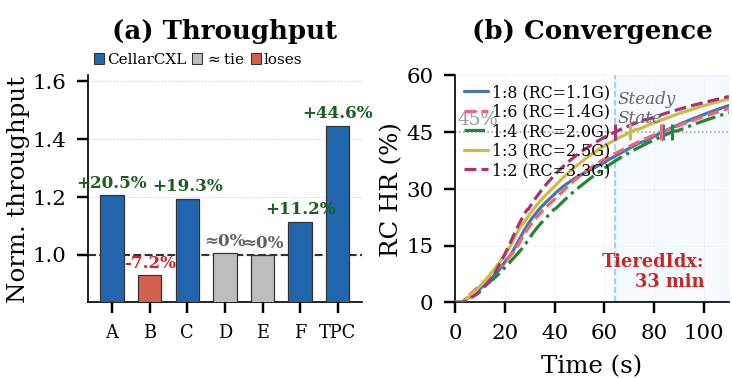
</p>

CellarCXL wins 5 of 7 workloads against baselines (bf-Tree, HybridTier, Tiered Indexing, Three-Tier), with up to **+44.6%** on TPC-C.

### Ablation Study (WS = 4 GiB, θ = 0.90, ReadOnly)

<p align="center">
  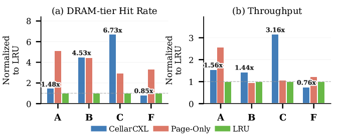
</p>

<p align="center">
  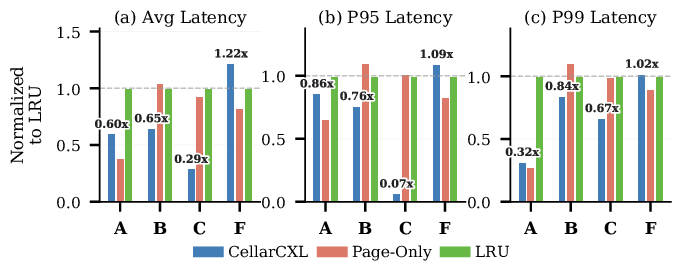
</p>

The ablation compares CellarCXL (`two_level`) against `page_only` and pure `lru` baselines across five metrics (DRAM hit rate, throughput, average latency, P95/P99 latency), all normalized to LRU. CellarCXL achieves up to **6.73×** DRAM hit rate and **3.16×** throughput over LRU on YCSB-C, while reducing P99 latency to **0.27×** on YCSB-A — confirming that record-level admission is the dominant contributor to performance gains.

## CXL Hardware Topology

<p align="center">
  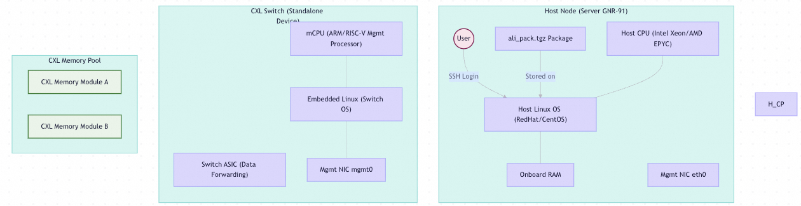
</p>

## License

See [LICENSE](LICENSE).
